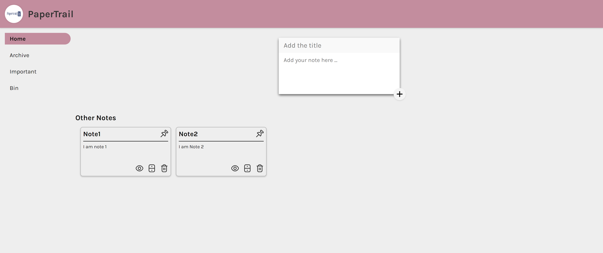

# PaperTrail - Note-taking app

PaperTrail is a powerful and versatile note-taking app designed to help you stay organized and productive.

## Features

- Pinned Notes - Highlight your most important notes and keep them at the top of your list with the pinned notes feature.
- Unpinned Notes - Unpinning notes removes them from the top of the list, allowing you to maintain a clean and organized workspace.
- Archive Notes - Archive notes that are no longer immediately relevant, but still worth keeping for future reference.
- Important Notes - Highlight and prioritize critical notes using the important notes feature. Mark notes as important to ensure they receive the attention they deserve.
- Delete Notes - Move unwanted notes to the bin.

## Tech Stack

**Client:** React, Javascript, CSS, HTML

## Live Link

- https://papertrail-ritik.netlify.app/

## Run Locally

Clone the project

```bash
  git clone https://github.com/hritikRajput/notes-app
```

Go to the project directory

```bash
  cd notes-app
```

Install dependencies

```bash
  npm install
```

Start the server

```bash
  npm run dev
```

## Screenshots


<br>

